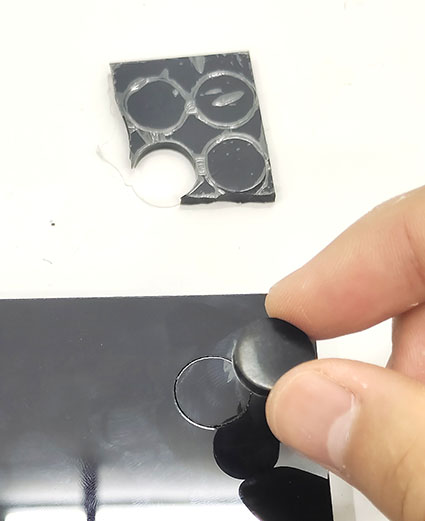
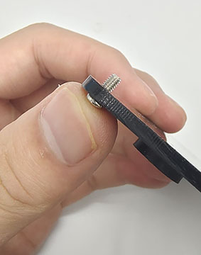
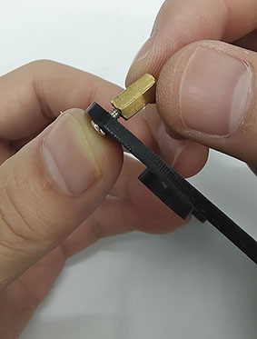
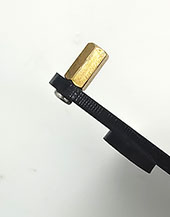
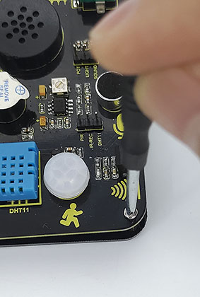
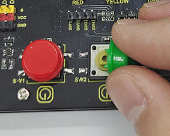

# Installation Steps

 

Step 1: Remove the protective film from the acrylic board. 

Step 2: Stick the four slip-mats in the positioning circle under the acrylic board. 

Step 3: Push the ten screws one by one through the holes from the bottom of the acrylic board (the side with slip-mats), and then screw copper pillars onto them, as shown below.

Step 4: Align the holes on the NANO expansion board with copper pillars. Do note whether the middle two holes are aligned. If not, rotate the board 180°. After adjustment, tighten the board with screws in place. 

Step 5: Install the button caps and potentiometer caps. It is easy to install  that you only need to push them in. 

Step 6: Install the development board. Pay attention to the position of USB interface, which is marked on the expansion board.

Installation is complete. 
