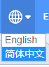
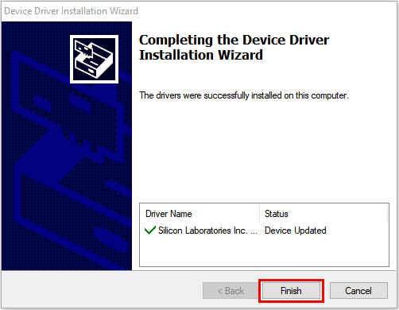
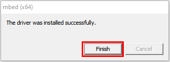
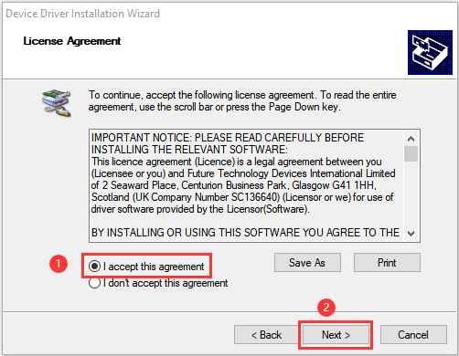
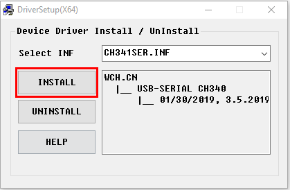
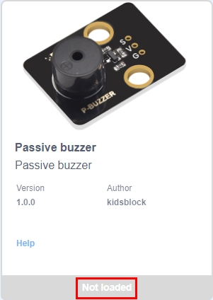
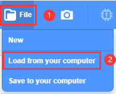
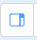
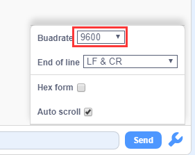

# **Installation and Using Method**

## **Windows System Kidsblock Installation**

1\. Download Kidsblock package: [http://xiazai.keyesrobot.cn/KidsBlock.exe](http://xiazai.keyesrobot.cn/KidsBlock.exe)

2\. After downloading, click to open “KidsBlock 1.1.4 Setup.exe”.

3\. Select “**Anyone who uses this computer(all users)**” and then click “**Next**”.

4\. Click “**Browse...**” to choose a path for your installation. Here we choose C Disk, of course you may choose any disk you like. Then click “**Install**”. Now the software is installing.

5\. After installation, click **“Finish**” to open Kidsblock.

6\. If you PC pops up a warning interface, don't worry, just click “**Allow access**” to retry to open Kidsblock.

## **MacOS System Kidsblock Installation:**

1\. Download Kidsblock Package: [http://xiazai.keyesrobot.cn/KidsBlock.dmg](http://xiazai.keyesrobot.cn/KidsBlock.dmg)

2\. After downloading, click to open KidsBlock, as shown below. Then please drag **KidsBlock Desktop** into **Applications**.

3\. Wait for the installation. When it is done, the KidsBlock icon will show up on your desktop. 

## **Kidsblock Using Method**

(**Here we take Windows System as an example, and it is only a reference for MacOS**)

### **1. Tool Bar Description**

### **2. Optional Language**

Click ![]./media/wps3.jpg to shift language into “English” or “简体中文”.

### **3. Driver Installation**

**NOTE: If your computer is already installed a driver for the development board, you may skip this step. If not, please follow the following procedures.**

Click ![]./media/wps4.jpg to select “**Install driver**”.

A. You will see the “Device Driver Installation Wizard”, please click “**Next**”.

B. A few seconds later, the following interface pops up. Then click “**Finish**”.

C. Click “**Next**”.

D. And click “**Finish**”.

E. If there is a warning, just click “**Allow**”. Then click “**Install**”.

F. If the warning repeatedly shows up, just click “**Install**” again.

G. After a while, click “**Finish**”.

H. Click “**Extract**”.

I. And click “**Next**”.

J. Click “**I accept this agreement**” and “**Next**”.

K. Click “**Finish**”.

L. Now click “**INSTALL**” to install the driver.

M. Wait a moment. When the driver is successfully installed, click “**OK**”.

### **4. Development Board Selection**

After installing the driver, open the software to enter the main page. Click  to find and select “Inventor kit for arduino”. 

 Click “**Connect**”. After the NANO board being connected, click “**Go to Editor**”. 

In this way, you will find some changes on the main page:  . These imply that NANO mainboard and Port(COM are both connected. 

### **5. Serial Port Selection**

If NANO mainboard is already connected yet  to manually connect Port(COM. 

Click  to pop up an interface, and then click “**Connect**”.

If the port is successfully connected, the following interface will show up. 

If you want to disconnect the port, click  to select “**Disconnect**”.

### **6. Function Bar Description**

### **7. Sensors and Modules (Can Be Skipped)**

**NOTE: For this kit, included sensors and modules are already integrated in the device you choose (Section 4 for details), so you can ignore this step. But, if you want to add a sensor excluded in this kit, please refer to the following illustrations.**

: Add sensor/module or expansion package of components.

Click  and “**Not loaded**” becomes “**Loaded**”. This module is successfully added! 

Click , as shown below.

If you want to remove this module, click  again and wait for “Loaded” to become “Not loaded”.

We only take passive buzzer as an example. For other sensors and modules, operations are the same. 

### **8. Code File Loading**

**Method 1:** Double-click file(.SB3) to open it. For instance, directly click  to open it.

**Method 2: **Open Kidsblock and click “**file**” to choose “**Load from your computer**”. Select a file(.SB3), like .

## **Code Uploading and Baud Rate Setting**

### **1. Code Uploading**

Add file 

After uploading, the box under the right conner will print “Hello Keyestudio!” per second.

### **2. Baud Rate Setting**

If the printing box is disappeared, click one of  at the upper-right conner to set.

: Small printing box

: Large printing box

: No box

If there is a box without any prints or with garbled characters, please check the baud rate. Click  to set the baud rate to the same as codes, that is 9600.

