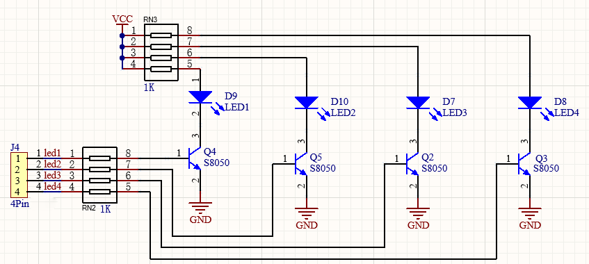
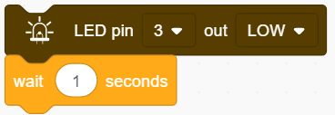
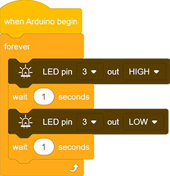

# **Project 1: Blinking**

###  **1.  Description**

LED blinking is a simple project designed for starters. You only need to install an LED on Arduino board and upload the code on Arduino IDE. 

This project reinforces the learning of Arduino conceptual framework and using methods for starters. 

###  **2.  Working Principle**

**LED lighting principle:** 

Generally speaking, limited IO ports of output current may cause enough-less brightness of LED, so NPN triode (Q2) is applied in circuit as a switch.
In this case, the LED will light up if the base(pin 1) of triode is at a high level. On the contrary, LED goes off when the base is at low.

**Triode switch controlling principle:**

To have a clear understanding of its principle, certain knowledge of electronic circuit is required. For details, please consult materials by yourself.
Briefly, LED lights up when the base(pin 1) is at a high level. In the same breath, the collector(pin 3) and emitter(pin 2) are connected, and then VCC passes through a current-limiting resistor to LED and finally to GND, which forms a circuit. On the contrary, LED goes off when the base is at low. In this circumstance, the collector and emitter are disconnected hence the circuit is not a closed loop.

### **3.  Wiring Diagram**

###  **4.  Test Code**

According to previous principles, we can control LED via power levels of pins on the development board.

1.Drag this "when Arduino begin" block in "Events".This is one basic block. Or else, the following code blocks won't execute.

2.Drag a "forever" in "Control" to circulate the execution of the including code blocks. This is another basic block.

3.Drag an "LED output" block in "LED" and set the pin to 3 and output to HIGH.

4.Drag a delay time block in "Control" and set "wait 1 seconds".

5.Set another LED output to LOW at pin 3 as well as "wait 1 seconds".

**Complete Code:**

###  **5. Test Result**

After uploading the code and powering on, LED will blink alternatively of on for 1s and off for 1s.

### **6. Code Block Description**

1.Code blocks will not execute if there is no "when Arduino begin".

2.Code blocks in this "forever" block will execute in a loop. 

3.In this block, you can choose a pin to output a HIGH or LOW level. 

4.You can type a delay time in the middle blank in the unit of seconds. 

