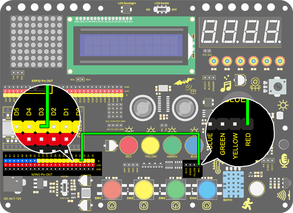
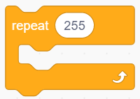

# **Project 2：Breathing Light**

### **1. Description**
Arduino breathing light utilizes on-board programmable PWM to output analog waveform. After powering on, LED brightness can be adjusted through duty cycle of the waveform to eventually realize a breathing light.
In this way, ambient light can be simulated by changing LED brightness along with time. Also, breathing light can form a colorful mini light show to construct a tranquil and warm environment.

### **2. PWM Working Principle**

PWM controls analog output via digital means, which are able to adjust the duty cycle of the wave (a signal circularly shifting between high level and low level).
For Arduino, digital ports of voltage output are LOW and HIGH, which respectively correspond to 0V and 5V.
Generally, we define LOW as 0 and HIGH as 1. Arduino will output 500 signals of 0 or 1 within 1s. If they are 500 "1", 5V will be output. Oppositely, if they are all 0, the output will be 0V. Or if they are 010101010101..., the average output will be 2.5V.
In other words, output ratio of 0 and 1 affects the voltage value. Honestly, it differs from real continuous output, yet the more 0 and 1 signals are output per unit time, the more accurate the control will be.

### **3. Wiring Diagram**

### **4. Test Code**

We adopt "for" statement to increase a variable from 0 to 255, and we define the variable as PWM output (analogWrite(pin, value)). By the way, a delay time may reinforce the control of LED shining time. Next, we use another "for" statement to decrease it from 255 to 0 with also a delay time to control LED dimming process.
As a result, a breathing light is complete.

1.Drag the basic two code blocks.

2.Drag the following block from "Variable Type", and define the name to "item" with an initial assignment "0". Put this block in "forever". 

3.Drag a "repeat" block from "control" and set it to 255 times, which is the maximum value of PWM.

4.Drag a "Change" block from "Variable Type", put "item" as its changed object and set the mode to "++".

5.Drag an "analogWrite" from “LED” and set the LED pin to 3. Then add an "variable" block in it and fill in the blank with "item". 

6.Drag a delay time block from "Control" and set the waiting time to 0.01s = 10ms. 

7.According to previous steps, build another code block with the only difference of variable mode "– –".

**Complete Code:**

### **5. Test Result**

After uploading the code, we can see the LED dims gradually rather than all of a sudden. It "breathes" evenly.
### **6. Code Block Explanation**

1.This definition block is used to set variable usable range, variable type , name and its initial value. 

2.Repeating times can be assigned in the blank of this repeat block. 

3.This block adds one to the variable. Input a variable name in the blank and its value will add one each time the code executing. "++" can be altered to "– –".

4.This block suntract one from the variable. Similarly, input a variable name in the blank and its value will reduce one each time the code executing. 

5.A certain analog output value and pins can be set in this PWM outptu block. Totally, six pins on Nano board cater for PWM, including pin 3, 5, 6, 9, 10 and 11. Besides, the analog value can be scheduled in the blank. 

