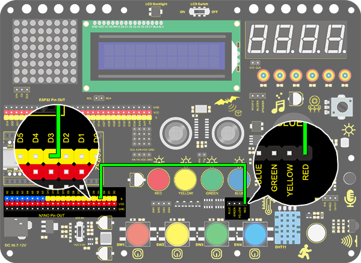
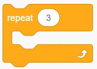
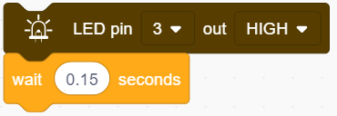
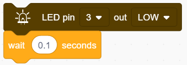
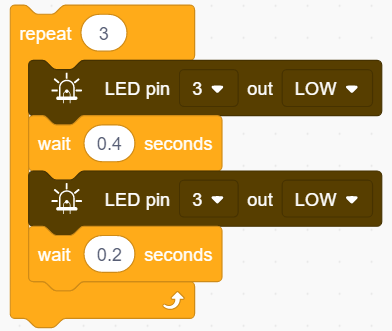
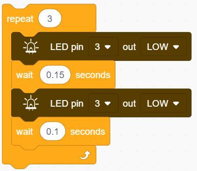
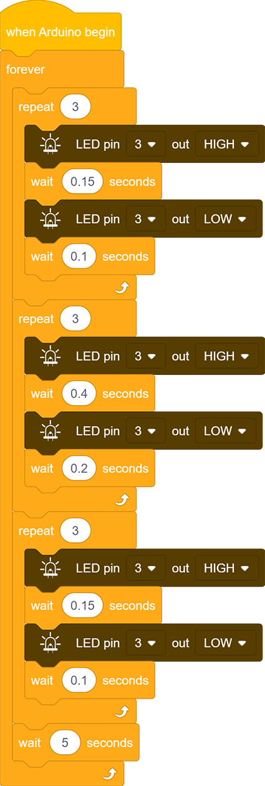

# **Project 3：SOS Distress Device**

### **1. Description**

Arduino SOS device is able to emit distress signals, which coincide with the principle of Morse code. It is convenient for emergencies.

### **2. Wiring Diagram**

### **3. Test Code**

What we should clear firstly is how SOS distress light blinks: LED quickly blinks three times for “S” and slowly blinks three times for “O”.
And then, we control the blinking times and duration via "for" statement and set interval time among letters.

1.Drag the two basic code blocks.

**Letter "S"**

2.Drag a "repeat" block from "Control" and set to 3 times, as "S" only needs to blink for 3 times. 

3.Drag an “LED output” block from "LED" and set the output to HIGH at pin 3. Put a delay block after it and set the its time to 0.15s.

4.Drag another “LED output” block and set the output to LOW at pin 3. Also add a delay block after it but set the waiting time to 0.1s.

**Letter "O"**

5.Refering to previous steps, build the following code block. Modify the HIGH ouput to delay 0.4s and LOW to 0.2s.

**Letter "S"**

6.Operate step 2, 3 and 4 again. 

7.Add a delay time of 5s to the end, and "SOS" will repeat every 5s. 

**Complete Code:**

### **4. Test Result**

After uploading the code, LED respectively blinks for 3 times in the sequence of quick, slow and quick, which forms "S.O.S". It repeates after 5s.

