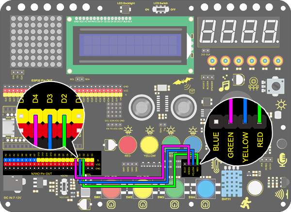
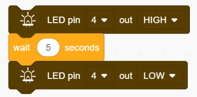
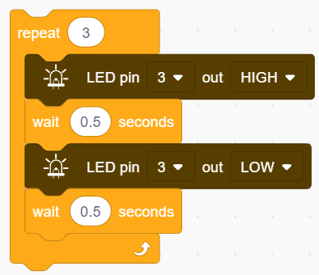
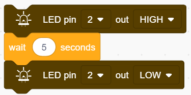
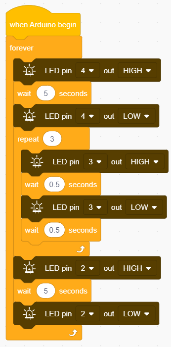

# **Project 4：Traffic Light**

### **1. Description**

The traffic light module limits the pedestrian and vehicular thoroughfare. It includes a red, a yellow and a green light, which imply different instructions.
**Red for Stop:** Pedestrians and vehicles stop proceeding.
**Yellow for Caution:** Pedestrians and vehicles are ready for stopping. If the drive is already in process, the speed should be slow.
**Green for Proceed:** Pedestrians and vehicles keep going with the abidance of traffic regulations.

In this project, you can program to control a mini traffic light. For instance, set the duration of each lights and the interval time among them. Besides, you may also add a timer to alter light colors to schedule.

### **2. Wiring Diagram**

### **3. Test Code**

We simply stimulate the traffic light: green LED lights up for 5s, yellow LED blinks for 3 times, and red LED lights up for 5s. And we set this to loop.
The blinking of yellow LED can utilize the code blocks we have mentioned in project 3. Thus, we now only need to set a lighting time to complete a traffic light.

1.Drag the two basic code blocks.

2.**Green LED lights for 5s:** Drag an “LED output” block from "LED" and set the output to HIGH at pin 4. Place a delay block after it and set the waiting time to 5s. Drag another “LED output” block but set the it to LOW. 

3.**Yellow LED blinks 3 times:** Drag a "repeat" block from "Control" and set it to 3 times. Put an “LED output” block in it and set the output to HIGH at pin 4 followed by a 0.5s delay time. Repeat this step but set the output to LOW, as shown below. 

4.**Red LED lights for 5s:** Do the same as step to, but set the output pin to 2. 

**Complete Code:**

### **4. Test Result**

After uploading the code, green LED will light up for 5s, yellow LED will blink for 3 times, and red LED will light up for also 5s, in circulation.

