# **Project 5：Rainbow Ambient Light**

### **1. Description**

Arduino 2812RGB LED is a programable colorful dreamy light, whose lighting color, brightness and rhythm are adjustable.
This rainbow ambient light can used as a dynamic decoration at will. Or you may control it to "dance with music".

Importantly, it can be improved as an alarm. Its built-in sensor detects the ambient surroundings to warn users by changing lighting colors, brightness and rhythm.

### **2. Working Principle**

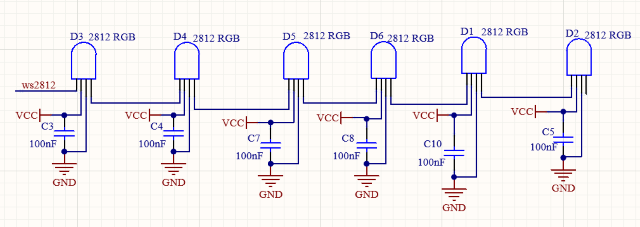
**Working Principle:** 

The data protocol adopts communication mode of single-line RTZ code.
After powering on and pixel resetting, DIN terminal receives data from the controller. The firstly arriving 24bit data will be extracted by the first pixel and be sent to the inner data register. And remaining data will be amplified by an amplification circuit and be transmitted through DOUT port to the next cascaded pixel. After being transmitted through pixels, the signal decreases 24bit each time.
Besides, the automatic amplification and transmitting technology offer unlimited number of cascade from signal transmitting, yet it is limited by transmitting speed.

### **3.Wiring Diagram**

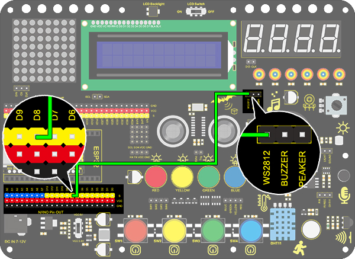

### **4. Test Code**

To begin with, let's learn how to set 2812 RGB colors! 

1.Drag the two basic code blocks.

2.Drag a “RGB LED” block from “RGB LED” and set the pin to 8 and the number of LED to 6.

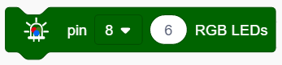

3.Drag an “LED brightness” block from “RGB LED” and set the pin to 8 and the brightness to 20. We don't recommend you to set it particularly bright, as it is bad for your eyes when debugging.

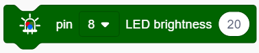

4.Drag a "clear all LEDs" block and set the pin to 8. 

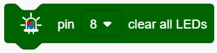

5.Drag six "show color" blocks and set pins to all 8. Orderly, define the RGB as: 0 to 0, 1 to 1, 2 to 2, 3 to 3, 4 to 4, 5 to 5, which respectively correspond to red, green, blue, purple and white. 

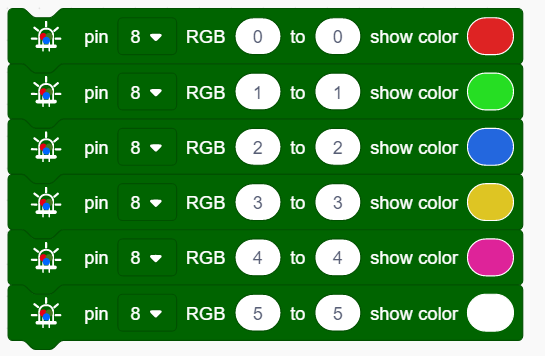

**Complete Code:**

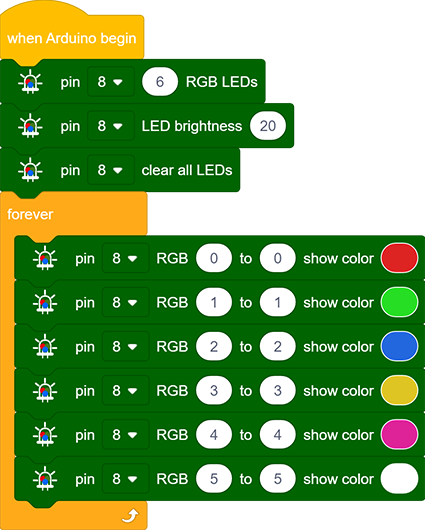

### **5. Test Result**

After uploading code, wiring up and powering on, the LED will light up in different colors as the scheduled sequence.

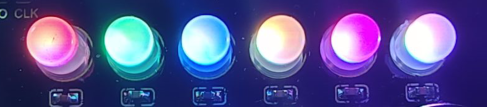

### **6. Expansion Code**

In this expansion project, let's model a mini light show!

1.Nest three "repeat" block and add a "variable +" in each, as follows. 

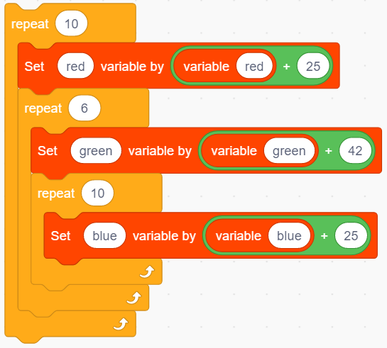

2.Put the above three variables in "RGB" block so that these color values are controlled. 

3.Put the "RGB" block in a "show color" block to display colors. And define a variable item to control the showing LED.

**Complete Code:**

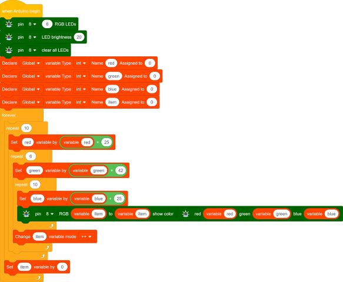

### **7. Code Block Explanation**

1.Set the number of 2812 RGB. One development pin can control multiple 2812 RGB LEDs, so we need to set the number in advance and select the connecting pin. 

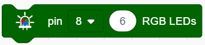

2.Set the brightness of 2812 RGB. Select the pin firstly and input the brightness value within 0-255, in which 255 is the brightest.

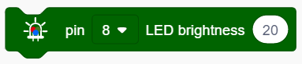

3.Turn off all 2812 RGB. This block clears all LED by selecting their common affecting pin. 

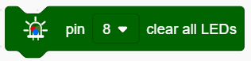

4.Control the display of 2812 RGB. We can fill the blanks to control the lighting LED and its color after selecting the pin. For instance, "0 to 0" means only the first LED lights up. After uploading the code, the first LED will turn on in the set color.

**NOTE:** The two blanks also can be filled with variables, so that a light show is able to be formed. 

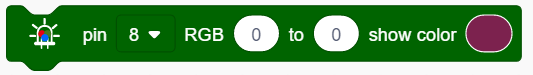

5.Set the color of 2812 RGB. The displaying color can be modulated by the value in red, green and blue(R, G and B). Although we have covered how to set the showing color in Point 4, it is a direct choice which does not facilitate the control of code. Thus, we add this block in the color settings of 2812 RGB.

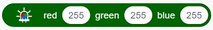

6.Set a gradient color of 2812 RGB. We firstly choose the pin and lighting LED(0-5 means all six LED), and then set the color value from 0 to 360. Variables also can be added. 

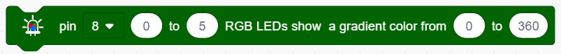

7.Set the distance. The blank should be input a number to indicate the shift distance. In this example code, it means to shift 1 unit in each loop. 

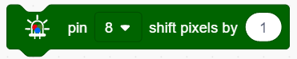

8.Set the rotation distance. We set the pin and input the rotation distance in the blank .

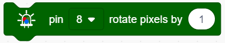

9.We set the pin firstly and define the pixel to "0 to 5". The max value is 360. We light 2812 RGB up through setting the current value. When the current value equals the maximum, all six LED light up.

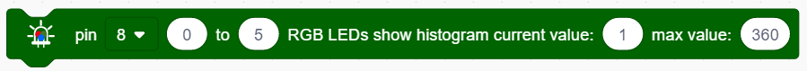
