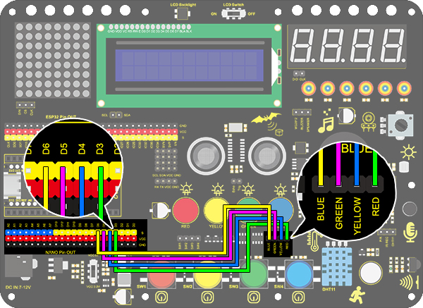
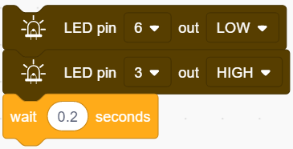
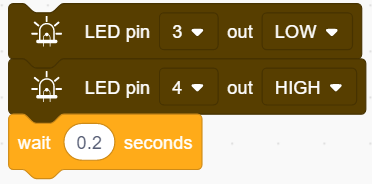
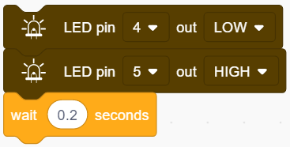
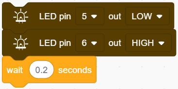
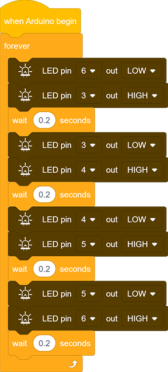

# **Project 6：Water Flow Light**

### **1. Description**

This simple water flow light project guides you in electronic packaging. In this project, we control LED to shift the color in a specified speed.

### **2. Wiring Diagram**

### **3. Test Code**

A water flow light consists of a stream of LED lighting from left to right and vice versa.

1.Drag the two basic code blocks.

2.Drag two "LED output" block from "LED" and set the output to LOW at pin 6 and HIGH at pin 3. And set a 0.2s delay. 

3.Drag another two "LED output" block and set the output to LOW at pin 3 and HIGH at pin 4. Also, set a 0.2s delay. 

4.Similarly, set the output to LOW at pin 4 and HIGH at pin 5 with a delay time of 0.2s.

5.Again, set the output to LOW at pin 5 and HIGH at pin 6 with a delay time of 0.2s. 

**Complete Code:**

### **4. Test Result**

After uploading code and powering on, the stream of LED light up from left to right and vice versa in a loop.

