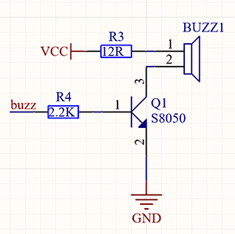
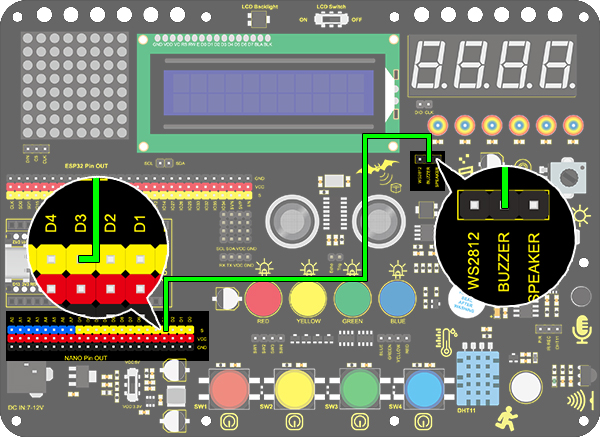
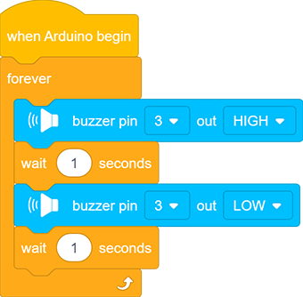

# **Project 7：Buzzer**
### **1. Description**
An active buzzer can function as an alarm, a reminder or an entertaining device. It provides reliable voice warning for you.
What's more, it stimulates various sounds and features high controllability, so that you can experience an interesting and real experiment.

### **2. Working Principle**

**Working Principle:** 

An active buzzer integrates a multi-vibrator, so it makes sound only by a DC voltage.
Pin 1 of the buzzer connects to VCC and pin 2 is controlled by a triode. When a high level is provided for the base (pin 1) of the triode, its collector (pin 3) and emitter (pin 2) link to GND, and then the buzzer emits sound.
Oppositely, if we offer a low level to the base, the rest of pins will be disconnected, so the buzzer will remain quiet.

### **3. Wiring diagram**

### **4. Test Code**

If the development board outputs a high level, the buzzer will emit sound. If it outputs a low level, the buzzer will stop ringing.
Thus, its code is similar to light up an LED.

1.Drag the two basic code blocks.

2.Set the “Buzzer output” block from “Buzzer” to HIGH at pin 3 with a delay of 1s.

3.Set another “Buzzer output” to LOW at pin 3 also with a delay of 1s. 

**Complete Code:**

### **5. Test Result**

After uploading code and powering on, the buzzer emits sound for 1s and stays quiet for another 1s, in circulation.

### **6. Code Block Explanation**

Buzzer output block. We firstly define the pin to 3 and then set the output to "HIGH" or "LOW". The buzzer will beep when at HIGH, while it will be quiet at LOW.

