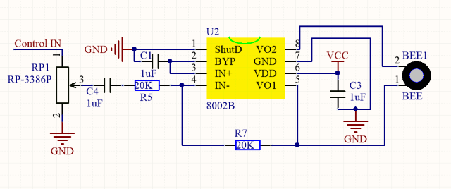
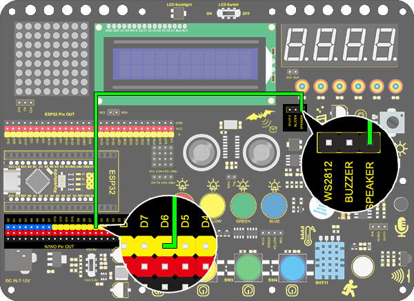
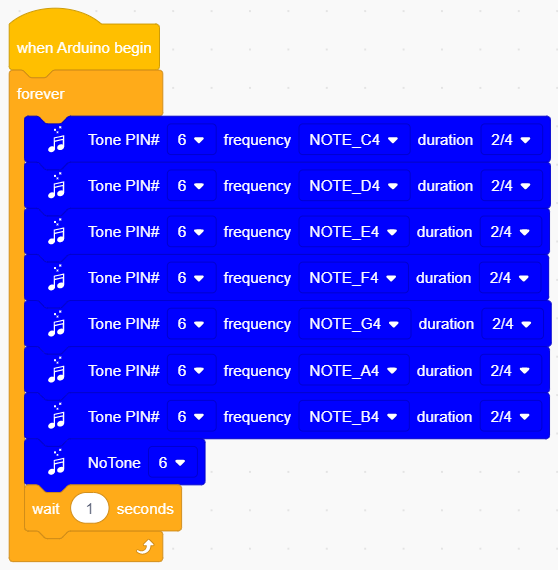
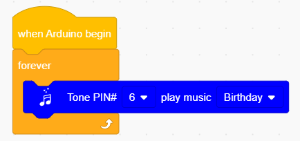

# **Project 8：Music Performer**

### **1. Description**
This project realizes a music player with an amplifier on the development board. This speaker can not only play simple songs, but also perform music made by yourself. Thus, you can program other interesting codes in the project to accomplish splendid learning outcomes.

### **2. Working Principle**

**Working Principle:** 

The electrical signal is input from pin 1 of RP1 (adjusts signal intensity, which is also the sound volume).
After coupling in C4 and passing R5, the signal reaches IN- pin of 8002B, in which it is operationally amplified and output to BEE1 speaker.

### **3. Wiring Diagram**

### **4. Test Code**

### **5. Test Result**

After uploading code and powering on, the amplifier circularly plays music tones with corresponding frequency: Do, Re, Mi, Fa, So, La, Si.

### **6. Expansion Code**

For a little more complicated, let's make it to play a birthday song. We have already added some songs in library so you can directly drag these song blocks from "Music". 

**Code:**

### **7. Code Block Explanation**

1.Set the tone frequency. After setting the pin, we can select the frequency to compose music. However, do not forget a delay time. 

2.It is also used to set the tone frequency. What differs is that it has already included a duration so that we can omitted a delay block. 

3.Play music. For convenience, we have integrated six songs in our code blocks. Therefore, you only need to select the pin to play different songs. 

4.Quit the play. Just select the relevant pin to stop the playing song.

