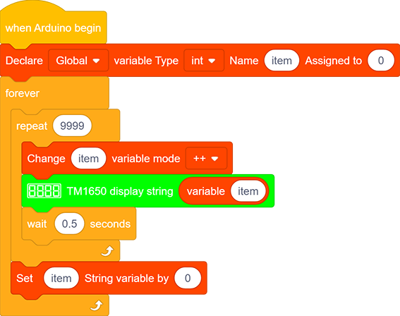

# **Project 9：Digital Tube Display**

### **1. Description**
This display module, whose display range includes 0 ~ 9 and simple letters, consists of four digital tubes with seven LED on each and can be used as a counter or a clock.

Moreover, multiple functions can be realized by connecting their pins to the development board, such as timekeeping and some game storing.

### **2. Working Principle**

**Working Principle:** TM1650 utilizes IIC protocol and adopts two bus lines (SDA and SCL).

The code is provided in our blocks, and the digital tube will display numbers via this code. 

### **3. Wiring Diagram**

### **4. Test Code**

To show numbers on the display, you only need to drag a "TM 1650 display" block from "Digital tube" and set the number string to 9999.

### **5. Test Result**

After wiring up and uploading code, the digital tube display shows "9999", as shown below.

### **6. Expansion Code**

Let's have some difficult operations. Rather than static numbers, we handle it to show some dynamic ones. The following code manipulates the tubes to display 1~9999 via a "for" loop.

1.Drag the two basic code blocks.

2.Drag a "variable Type" block from "Variables". Set the type to int and name to item, and assign 0 as its initial value.

3.Drag a "repeat" block from "Control" and set to 9999 times. 

4.Drag a "variable mode" from "Variables", define its name to item and set the mode to "++".

5.Drag a "TM 1650 display" block from "Digital tube" and replace the string value with variable item. Add a delay time of 0.5s after it.  

6.Add a "set variable" block after the "repeat". Set item variable by 0. Otherwise, the item value will be out of display range after 9999 loops. 

**Complete Code:** 

### **7. Code Block Explanation**

1.Set the display string. Directly type numbers or letters you want to display in the blank. 

2.Set the ON or OFF of this TM 1650 digital tube. Each tube can be controlled separately. 

3.It is able to clear the display or used as a master switch to turn on or turn off the digital tube. 

