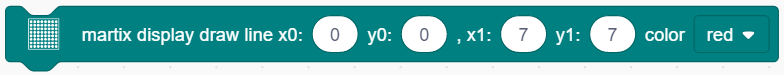
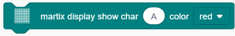
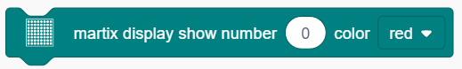
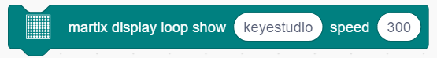

# **Project 10：Dot Matrix Display**

### **1. Description**
This module consists of a 8x8 LED dot matrix with one control pin for each row as well as each column to adjust the brightness of LED.
Connecting with Arduino board, the brightness of LED is controlled via programs. In this way, simple characters and figures are able to be displayed. It also can be applied in game machines or screens.

### **2. Working Principle**

**Working Principle:** 

MAX7219 is an IC with SPI communication and controls 8x8 dot matrix. The MAX7219 SPI communication has integrated in our libraries and you can recall directly.

### **3. Wring Diagram**

### **4. Test Code**

1.Drag the two basic code blocks.

2.Drag a "init matrix display" from “Matrix” and set CS to 10. DIN and CLK are fixed pin respectively to 11 and 13.

3.Drag a "set brightness" block and set it to 3. Don't set an extreme high value when debugging. It may hurt your eyes. 

4.Drag a "image" block and choose heart icon.

5.Lastly do remember to add a "refresh" block at the end. 

**Complete Code:**

### **5. Test Result**

After wiring up and uploading code, a heart will be displayed on the dot matrix, as shown below.

### **6. Code Block Explanation**

1.Set the CS pin. In the code, DIN is fixed to 11 and SLK to 13, yet CS pin is optional. For convient wiring, we select 10 (Attention: pin 12 is not available for CS).

2.Draw pixels. This code block will light up or turn off pixels on the dot matrix by axis x and y, with red for on and black for off. 

3.Draw line. Locate the line by two group of coordinate points, also with red for on and black for off. 

4.Show characters. We have add character libraries so you only need to type a letter(only one) to display it on the dot matrix. Besides, it must be used cooperatively with a "rotation 180°" block. 

5.Show numbers. Similarly, you only need to type a number(only one) to display it on the dot matrix, and it also must be used cooperatively with a "rotation 180°" block. 

6.Show scrolling character strings. Collocating a "rotation 180°" block, the specified scrolling strings will be displayed after setting its speed. 

7.Display image. For convenience, we have already integrated some emotion icons which can be selected directly. 

8.Display fill colors. You may set to black (LED goes off) or red(LED lights up).

9.Refresh the display. The dot matrix must be refreshed if it displays something. Or else, an errer may occur.

10.Set the brightness. You can lower the brightness when debugging to avoid offending to your eyes. 

11.Set rotation angles. For high compatibility with more code, some data and icons need a rotation with the avoidence of inverted display.  That is why a "rotation 180°" block is necessary in codes. 

