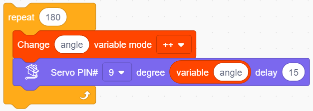
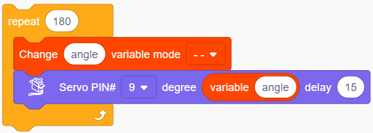
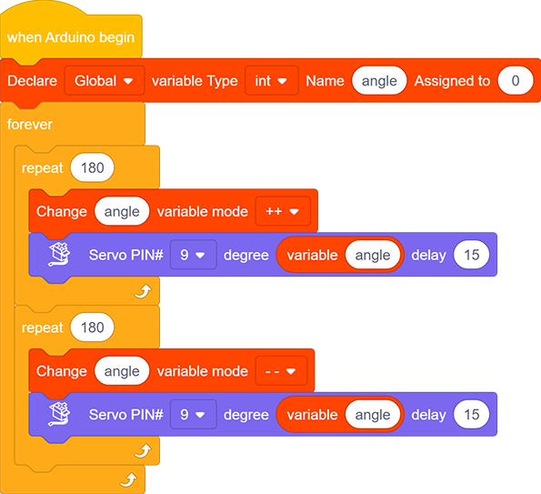

# **Project 12：Servo**

### **1. Description**
This servo features high performance and high precision with a maximum rotation angle of 180°. Weighting only 9g with a tiny size, it is perfectly suitable for any mini devices in any occasion.

What's more, it enjoys short startup time, low noise and strong stability.

### **2. Working Principle**

**Angle Scale:** 180° (commonly 360°, 180° and 90°)

**Drive Voltage:** 3.3V / 5V

**Pin:** Three-wire

**GND:** Grounded, in brown

**VCC:** power supply pin connecting to +5v/3.3V, in red

**S:** Signal pin controlling PWM signal, in orange

(1)-1684483122626-1.png)

**Control Principle**:
The rotation angle is controlled via duty cycle of PWM.

Theoretically, standard PWM cycle is 20ms(50Hz), so pulse width should distribute within 1ms~2ms. However, the actual pulse width reaches 0.5ms~2.5ms, corresponding to 0°～180°.

Pay attention that, for the same signal, the rotation angle vary from servo brands.

### **3. Wiring Diagram**

.jpg)

### **4. Test Code**

1.Drag the two basic blocks and put a "variable" block between them. Set the variable type to int, name to angle, and assign 0 as its initial value. 

2.**Servo gradually rotates from 0° to 180°:** 

Add a repeat block and set to 180 repeat times (180 angles). Drag a "change variable" and a "servo" block and put them in the repeat one. Name the variable "angle" and select the mode "++". Set Servo PIN to 9 and degree to the named variable. Don't forget to delay 15s.

3.**Servo gradually rotates from 180° to 0°:** Repeat step 2, but set the variable mode to "- -".

**Complete Code:**

### **5. Test Result**

After wiring up and uploading code, the servo starts to rotate from 0° to 180° and vice versa.

### **6. Code Block Explanation**

1.Set the values of Servo. Servo pin and rotation angle can be controlled by setting parameters on this block.

2.Read the current degree of the Servo. 

