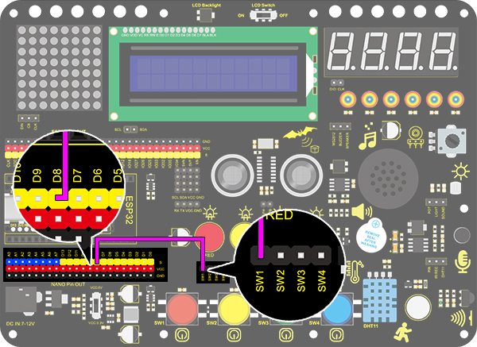
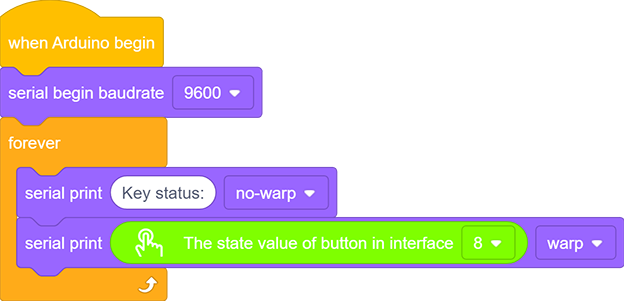
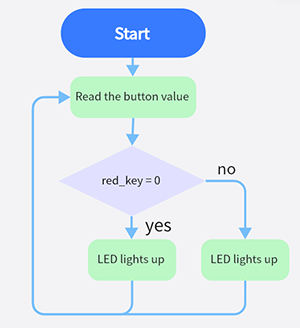
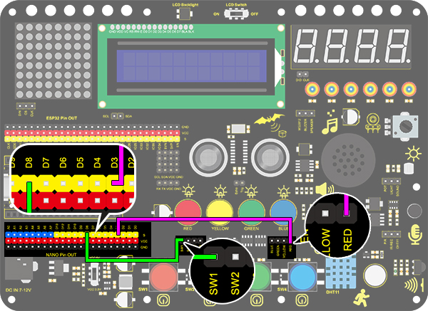
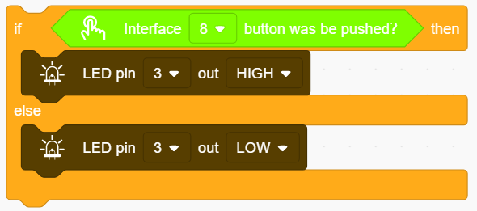
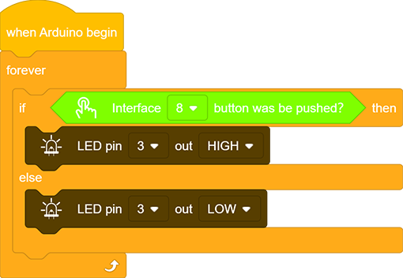
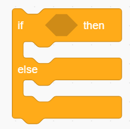
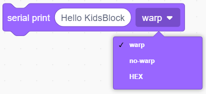

# **Project 13：Mini Lamp**

### **1. Description**
In this project, we control a lamp by Arduino UNO and a button. When we press the button, the state of the lamp will shift (ON or OFF).

### **2. Working Principle**

**Working Principle:** 

When the button is released, a voltage VCC passing through R29 provides a high level for S terminal. 

When it is pressed, pin 1 and 3, pin 2 and 4 are connected and voltage on S1 arrives GND as a low level. At this moment, R29 avoids a short circuit between VCC and GND.

### **3. Wiring Diagram**

### **4. Test Code**

1.Add two basic blocks.

2.Drag a "baud rate" from “Serial” and set it to 9600. 

3.Then drag a "print" block from “Serial”, type “Key status:” in the blank and set it to "no-warp".

4.Drag another “Serial print” block  from “Serial” and set the mode to "warp". Add a "state value of button" from “Button” and set the interface to 8.

**Complete Code:**

### **5. Test Result**

After wiring up and uploading code, open the serial monitor and set the baud rate to 9600. 
When we press the button, serial port prints "Key status: 0"; When we release the button, serial port prints "Key status: 1".

### **6. Expansion Knowledge**

We then will control the LED via a button.

**Flow Diagram:**

**Wiring Diagram:**

**Code:**

1.Drag two basic blocks. 

2.Drag a "if&else" block from “Control”. Add a "button pin" block from “Button” after "if" and set its interface to 8. 

3.Put an "LED output" block under "if" and set the output to HIGH, and put another under "else" and set to LOW. LED pins are both at 3.

**Complete Code:**

### **7. Code Block Explanation**

1.Determine whether the button is pressed. If it is, this block expresses true; If not,it is false.

2.Read the current button value. When the button is pressed, the value is 1. Or else, it is 0.

3.If the condition in the hexagon is true, "if" block will be executed. Otherwise, the program runs "else" according to block.

4.Set the baud rate. Please guarantee the serial baud rate fit the counterpart of serial monitor, or it won't print anything. The commonly used baud rate are 9600 and 115200, and here we set to 9600.

5.Print characters on serial monitor. The printed words are what you type in the blank. Besides, three print modes are included: warp, no-warp and HEX (hexadecimal). 

