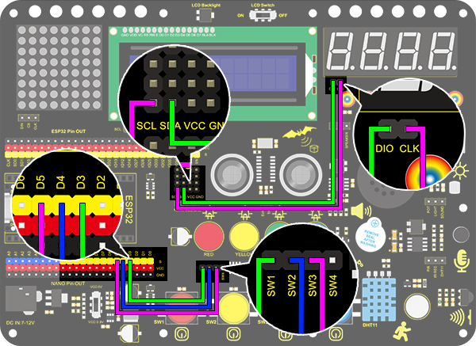

# **Project 14：Counter**

### **1. Description**
Arduino 4-bit digital tube counter can record numbers within 0~9999. It features display speed and counting mode adjustment as well as resetting function. 

This module is wildly applied in real-time counter (such as button-press and DC motor rotation count), gaming and experiment equipment.

### **2.Flow Diagram**

### **3. Wiring Diagram**

### **4. Test Code**

1.Drag the two basic blocks and put a "variable" block between them. Set the variable type to int and name to item. Assign 0 as its initial value. 

2.Drag an "if" block from “Control” (it executes only when its condition is satisfied). Put a “Button pressed” block from “Button” to the condition box(the hexagon one) and set the interface to 5. Drag a "variable mode" block and put it after "then", and define it as "item" and set the mode to "++".

3.Repeat step 2, but set the interface to 4 and mode to "– –".

4.Drag another "if" block from “Control” and define its condition that "interface 3 button was be pushed?". Put a variable setting block after "then" and set the "variable by 0".

5.Drag one more "if" block from “Control”. Find the "＞" block in “Operators” and fill the left blank with "variable item" and the right with "9999". Also, put a variable setting block after "then" and set the "variable by 0".

6.Drag a "TM1650 display" block from "Digital tube" and set the displayed string to "variable item" block. Finally, don't forget to add a 0.2s delay. 

**Complete Code:**

### **5. Test Result**

After wiring up and uploading code, press green button to add 1, yellow to minus 1, and red to reset. Press the button and hold, and the displayed value will keep adding or subtracting.

### **6. Code Block Explanation**

A greater-than block is used for judgment between two values. These two blanks can be replaced with either numbers or variables. 

