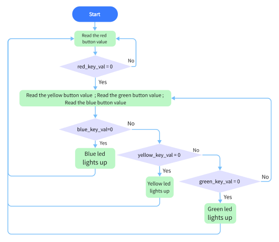
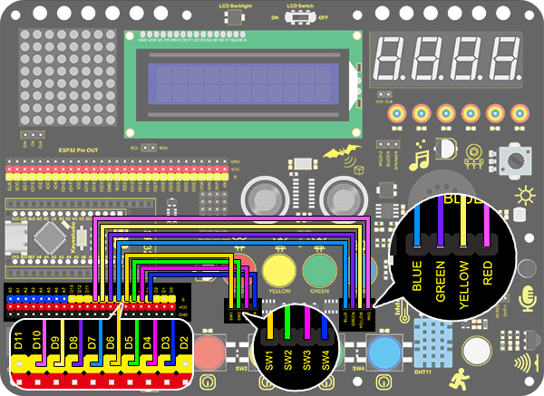
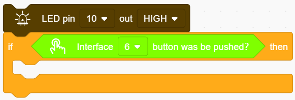
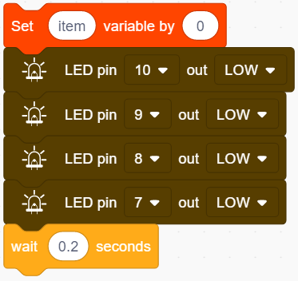
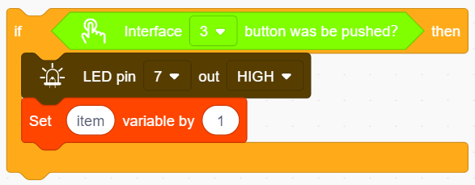
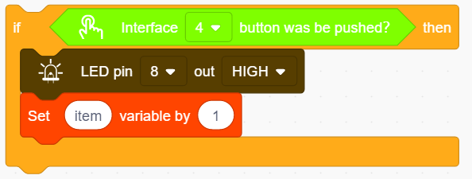
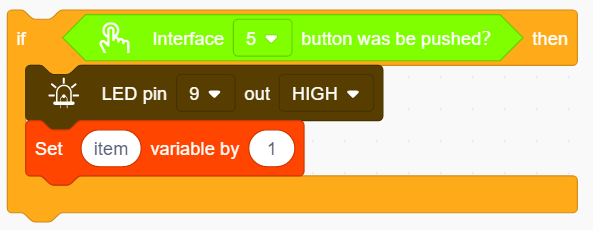
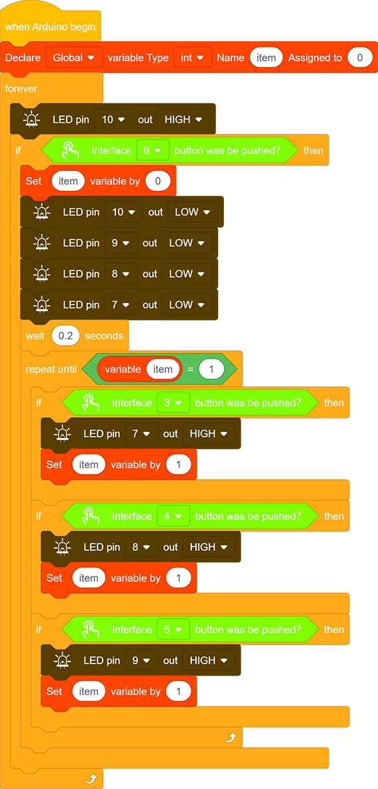

# **Project 15：Responder**

### **1. Description**
This programable responder inputs and receives signals through Arduino development board and a group of buttons, and it judges the correctness of answers by an LED.

Responders exercise students' reaction ability and draw their attention to questions. If the answer is correct, the respondent obtains a lot scores. 

Moreover, it simplifies teachers' manipulation of question-grabbers and cuts answer clutters. It may even stimulate students' interests in learning. 

### **2. Flow Diagram**

### **3. Wiring Diagram**

### **4. Test Code**

1.Drag the two basic blocks and put a "variable" block between them. Set the variable type to int and name to item with an initial assignment of 0.

2.Add an "LED output" block, define its pin to 10 and set the output to HIGH.

3.Drag an "if" block and add the condition "interface 6 button was be pushed?".

4.Add a variable setting and four LED output blocks under "then". Among them, we name the variable "item" with an assignment of "0", and set all outputs to LOW respectively at pin 10, 9, 8 and 7 (The responder works only when all LED light out). Likewise, don't forget a 0.2s delay. 

5.Add a "repeat until" block and set the "until" to "item = 1", as shown below. When item = 1, exit the loop. 

6.Drag another "if" block and set the condition "Interface 3 button was be pushed?". Add an "LED output" block under "then" and set the output to HIGH at pin 7. And add a "set item variable by 1" to exit this condition block. 

7.Repeat step 6, but set interface to 4 and LED pin to 8. 

8.Operate step 6 again, but set interface to 5 and LED pin to 9. 

**Complete Code:**

### **5. Test Result**

Wire up and upload the code. The answers of respondents are only valid when the red LED is off(red button is pressed). 

When someone presses his/her button(yellow, green or blue), the appropriate LED as well as the red counterpart lights up. By now, rest of LED cannot turn on when pressing buttons. The responding action can be performed only when the red button is pressed again.

### **6. Code Block Explanation**

An equal block is used to judge whether the two values are equal. 

