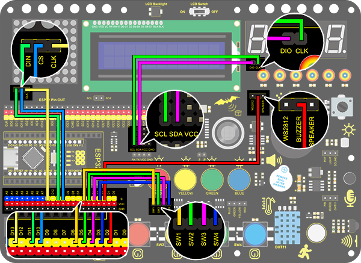
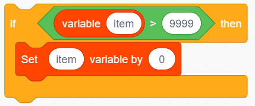

# **Project 16：Time-bomb**

### **1. Description**
This project will give you an opportunity experience an interesting timebomb game.  

In this project, the dot matrix represents your timebomb, while the digital tube displays remaining time. Buttons can not only control the bomb but also set its time. You may set a countdown to control this bomb, and it explodes when the countdown is over. Beyond that, a buzzer is adopted to alarm. 

Anyhow, by programming on multiple sensors, your comprehensive capability of logic thinking can be enhanced. 

### **2. Flow Diagram**

### **3. Wiring Diagram**

### **4. Test Code**

1.Drag that two basic blocks.

2.Add an "init matrix display" block from "Matrix" and set the pin CS to 10. What follows it are a "brightness" block with its value of 7 and a "variable" block (set variable type to int and name to item, assign 0 as its initial value).

3.In "Matrix", drag a "fill color" block and select "black"(i.e. all LED go off to clear previous display). Add a "display image" to define a new icon, and here we choose a smile face. Then, put a refresh block to renew the display. 

4.Drag an"if" block and fill the condition box with "interface 3 button was be pushed?". Add a "variable mode" block after "then" and set its name to item and mode to "++".

5.Repeat the operation in step 4, but set the interface to 4 and the mode to "- -".

6.Drag an "if" block to judge whether pin 5 is pushed. In this "if", we add a repeat block and set its stopping condition that the variable "item" equals 0 (item = 0). 

7.In the "repeat until" loop, put a "variable mode" and set "item" to "- -", as shown below. Drag a "TM1650 display" block from "Digital tube" and define the showing string as "variable item" block. Then add a "buzzer output" block and set output to HIGH at pin 2 followed by a 0.5s delay. Re-operate the last procedure but set the output to LOW. 

8.Program another loop code and define the quit condition as "interface 6 button was be pushed?". The following executions are in this loop. Put a "TM1650 display" block and define the showing string as "variable item" block.  Then repeat step 3 but here we set the image to a crying face. 

9.Drag an "if then" block and fill the blank with a greater-than condition: item ＞ 9999. Add a statement "set item variable by 0" in this condition block. 

10.Drag a "TM1650 display" from "Digital tube" and define the showing string as "variable item". For the same, don't forget to delay 0.2s.

**Complete Code:**

### **5. Test Result**

After wiring up and uploading code, press blue button to add time, green to reduce and red to reset. Press yellow button for counting down. When it is over, the bomb explodes. 
