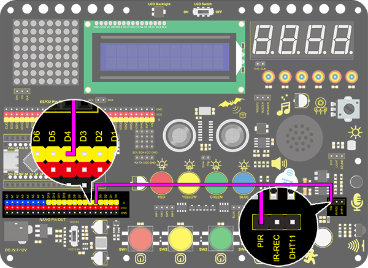
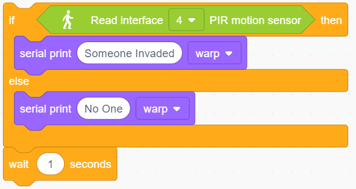
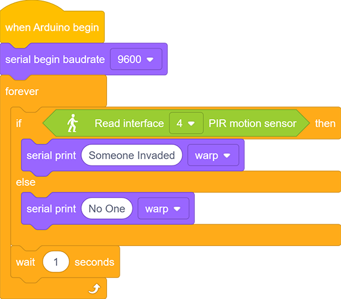
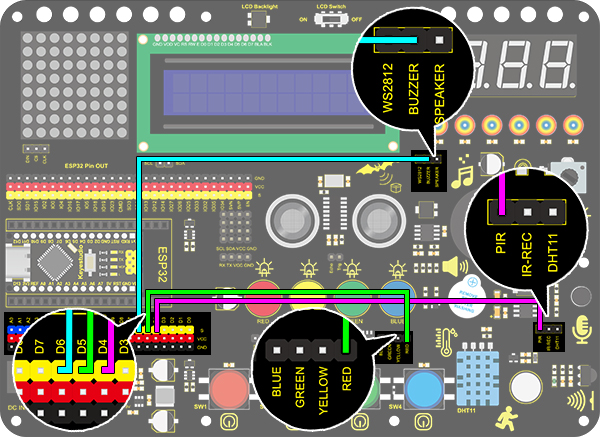
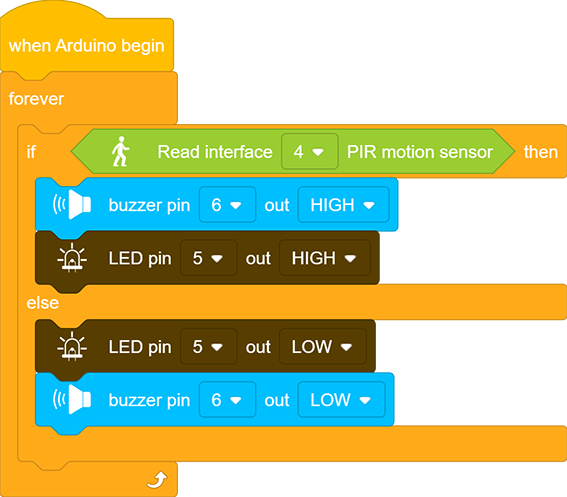

# **Project 17：Invasion Alarm**

### **1. Description**
This simple invasion alarm detects invaders in houses or small offices and warns the host to take measures in time. 

In this project, the sensor monitors a certain area. Some device on Arduino board will trigger LED to light up and buzzer to beep for caution if a movement is detected in that zone.

Virtually, this module features practicability, simpleness and low costs. With the exception of home and office, it also applies to factories, warehouses and markets, which, to a large extent, protects property security.

### **2. Working Principle**

**Working Principle:** 

Human body(37°C) always emits infrared ray with a wavelength of 10μm or so, which approximates to that of the sensor detected. On this account, this module is able to detects human beings movement. If there is, PIR sensor outputs a high level about 3s . If not, it outputs a low level . 

### **3. Wiring Diagram**

### **4. Test Code**

1. Add the two basic blocks and drag a "baud rate" block from “Serial” between them. Set the serial baud rate to 9600.

2.Add an "if&else" block. Put a "read PIR motion sensor" block in the hexagon box and set the interface to 4, thus it will determine whether there is a human motion. Add two "serial print" blocks after "then" and "else" and set both modes to "warp". If the condition is satisfied, print “Someone Invaded”. Or else, print “No one”. 

3.Last but not least, delay 1s to limit the printing speed. 

**Complete Code:**

### **5. Test Result**

After wiring up and upload code, open serial monitor to set baud rate to 9600. When the sensor detects movement, the serial port prints "Someone Invaded", or else, it prints “No One”.

### **6.Expansion Code**

In this expansion project, let's make an invasion alarm. When the PIR sensor detects human, LED lights out and the buzzer emits sound. By contrast, LED goes off and the buzzer stays quiet.

**Flow Diagram:**

**Wiring Diagram:**

**Code:**

### **7. Code Block Explanation**

When PIR senses human motions, it outputs a high level. Therefore, we can tell whether there is a movement by reading the development board pin connected to this sensor. 

