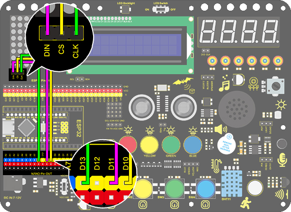
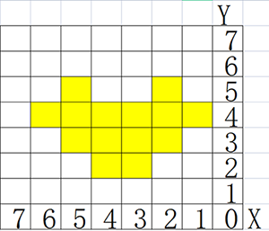
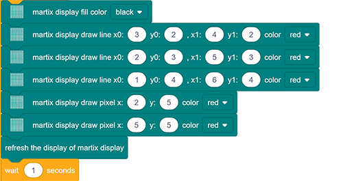
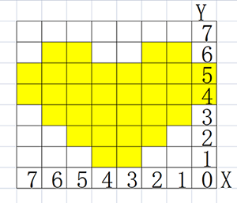
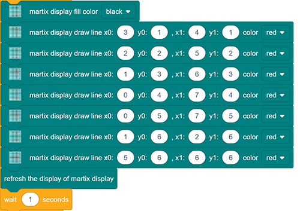
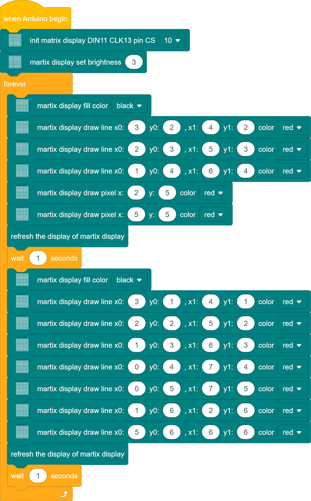
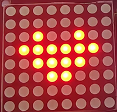
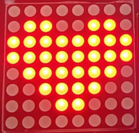

# **Project 18：Beating Heart**

### **1. Description**
In this project, a beating heart will be presented via an Arduino board, 8X8 dot matrix display, circuit board and other electronic components.
By programming, you can control the beating frequency, heart dimension and its brightness. 

### **2. Wiring Diagram**

### **3. Test Code**

1.Drag the two basic blocks. 

2.Initialize the dot matrix display. Set the CS pin to 10 and its brightness to 3. Put these two executions between the basic blocks.

The following executions are all in "forever" block.

3.Clear the display. Control the display to draw lines and establish coordinates system and its origin as the following. Then, refresh the display to show the smaller heart with a delay of 1s. 

4.Repeat step 3 but draw lines as the picture below to show a bigger heart. 

**Complete Code:**

### **4. Test Result**

After wiring up and upload code, the two sizes of hearts are displayed alternately. 

