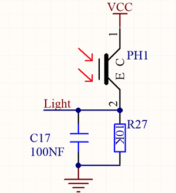
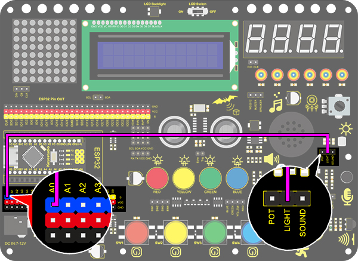
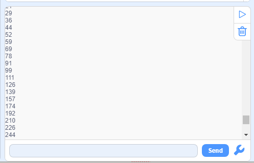
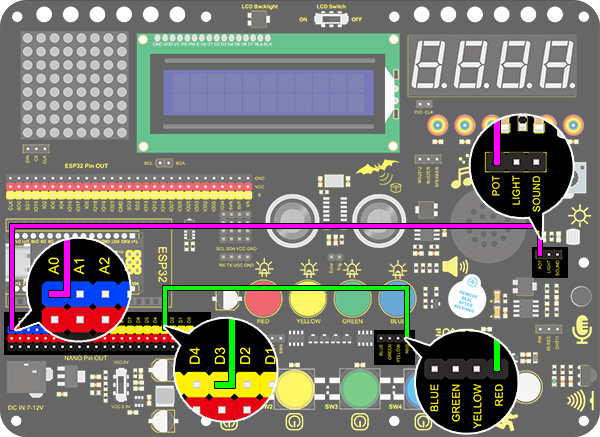
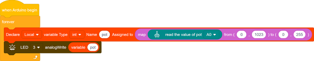

# **Project 19：Dimming Light**

### **1. Description**
The dimming lamp adjusts the brightness of LED via a potentiometer and an Arduino controller. For potentiometer, the brightness is influenced by different resistance, which can be read and adjusted by connecting the meter pins to digital/analog pins on board. 

What's more, this system is applied to control voltage/current of other devices, such as fans, bulbs and heaters. 

### **2. Working Principle**

**Working Principle:** 

Essentially, potentiometer is a resistor with changeable resistance. According to Ohm's law(U=IR), the resistance affects the voltage.

In this project, the maximum resistance is 10K. The Nano board will equally divide the voltage of 5V into 1024 parts (5/1024=0.0048828125). The analog voltage is obtained by multiplying the read value and 0.004882815.

**NOTE:** 
If you power the module by only USB, the working voltage may not reach 5V, which causes a smaller analog value. So please connect an external DC 7-12V power supply if necessary. 

### **3. Wiring Diagram**

### **4. Test Code**

The analog value can be read:

1.Drag the two basic blocks. Put the baud rate setting block between them and set to 9600.

2.Add a "serial print" block in "forever" loop, and select "warp" as the print mode.

3.Drag a "read the value" from “pot” to the serial print, and set the pin to A0. 

### **5. Test Result**

After wiring up and uploading code, open serial monitor to set baud rate to 9600, and the analog value will be displayed within the range of 0-1023.

### **6. Expansion Code**

We control the brightness of LED via a potentiometer. 

As we know, it is influenced by PWM. However, the range of analog value is 0-1023 while that of PWM is 0-255. Hence, we need a "**map(value, fromLow, fromHigh, toLow, toHigh)**" function to adjust the range.

**Wiring Diagram:**

1.Drag the two basic blocks.

2.Add a variable block and set it to local. Select "int" as its type and name it as "pot". 

3.Drag a "map" function from “Data” and put it to the assignment position. Set the value of "map" to "read the value of pot A0", whose range is from (0,1023) to (0,255).

4.Finally add an "LED analogWrite" block. Set the pin to 3 and analog value to the variable "pot".

**Complete Code:**

### **7. Code Block Explanation**

1.**map** function. The analog value range can be converted from 0-1023 to 0-255. We have known that LED brightness is controlled via PWM, yet the range of PWM is 0-255 while that of analog value is 0-1023. Thus, the later need a conversion through this f.

2.Read the analog value of potentiometer by setting its pin. 

