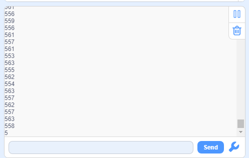

# **Project 20：Light Pillar**

### **1. Description**
The resistance(less than 1KΩ) of the photoresistor varies from the light, hence it can control the brightness of the dot matrix. When controlling, we connect this resistor with an analog pin on the board to monitor the change of resistance. In this way, the light automatically controls the brightness of the display. 

Besides, it is widely applied to our daily life. For instance, a curtain automatically opens or closes according to the outer light intensity. 

### **2. Working Principle**

**Working Principle:** 

When it is totally in dark, the resistance equals 0.2MΩ, and the voltage at signal terminal (point 2) approaches to 0V. The stronger the light is , the smaller the resistance and voltage will be.

### **3. Wiring Diagram**

### **4. Test Code**

The photoresistor value can be read:

1.Drag the two basic blocks. Put the "baud rate" block between them and set it to 9600.

2.Add a "serial print" block in "forever" loop with the mode "warp".

3.Drag a "read the value" block from “Light” to the "serial print" block, and set the pin to A0.

### **5. Test Result**

After wiring up and uploading code, open serial monitor to set baud rate to 9600, the analog value will be displayed, within the range of 0-1023. 

### **6. Expansion Code**

In this expansion project, we use this resistor to sensing the ambient light intensity. The middle two columns are included in this experiment to represent light intensity. The lighter it is, the more the lighting LED will be. This forms a "light pillar".

**Wiring Diagram**

1.Drag the two basic blocks. 

2.In "Matrix", initialize the dot matrix display and set pin CS to 10. Add a "brightness setting" block and assign to 2.

3.Drag a "variable" block. Set its range to Local, type to int and name to light.

4.Assign a map function to the variable. Add "read the value of light A0" from "Light" to the value of map function, whose range is from (0,1023) to (0,7).

5.Find the following blocks in "Matrix". Clear the display first, and then draw lines on the display at dots (x0:3  y0:0, x1:3  y1: variable light) and (x0:4  y0:0, x1:4  y1: variable light). Finally refresh the display of matrix.

**Complete Code:**

### **7. Code Block Explanation**

Read the analog value of photoresistor by setting the pin. 

