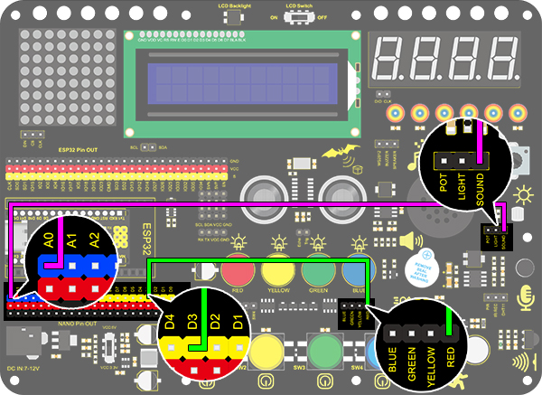

# **Project 21：Voice Control Light**

### **1. Description**
Voice control light module uses sound to control the brightness of LED. It can connect to other sensors, for example, microphone converts sound to changing voltage signal to be received by Arduino to control the LED on and off.

### **2. Working Principle**

**Working Principle:** 

When detecting a sound, the electret-film in microphone vibrates, which changes the capacitance and generates a subtle change of voltage. 
Next, we make use of LM386 chip to build a proper circuit to amplify the detected sound up to 200 times, which can be adjusted by a potentiometer. Rotate it clockwise to enlarge the times. 

### **3. Wiring Diagram**

### **4. Test Code**

Find the "read the value" block in “Sound”, and print the read sound in the serial port. Construct blocks as follows. Pay attention that do not add a delay when using sound sensor.

### **5. Test Result**

After wiring up and uploading code, open serial monitor to set baud rate to 9600, the analog value will be displayed.

### **6. Expansion Code**

The commonly seen corridor light is a kind of voice control light. Meanwhile, it also includes a photoresistor. 

Differed from that, here we establish a model that an LED is only affected by voice. When the analog volume exceeds 100, LED lights up for 2S and then goes off.

**Flow Diagram:**

**Wiring Diagram:**

1.Drag two basic blocks and put a variable block between them. Set the type to int and name to item. Assign its initial value to 0.

2.Add a variable block and fill the name with "item", set the value to "read the value of sound A0".

3.Drag an "if&else" block, and fill the hexagon with a greater-than block (set to: item＞100). If the condition is satisfied, LED outputs a HIGH level at pin 3 with a delay of 2s; or else, it outputs a LOW level at the same pin without a delay. 

**Complete Code:**

### **7. Code Block Explanation**

Read the value of sound by setting the related pin.

