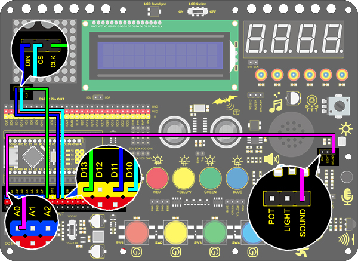

# **Project 22：Noisemeter**

### **1. Description**

Arduino noisemeter detects and shows noise in an intriguing way. It embodies the voice signal to a sequence of dots, which are converted into patterns to be displayed on the dot matrix. 
### **2. Wiring Diagram**

### **3. Test Code**

1.Drag the basic blocks and initialize the display. Set the pin CS to 10 and brightness to 2. Then add a variable block and select int and name it as "item" with an initial assignment of 0.

2.Add a variable block and name it as "item". Adopt a map function to convert the read sound value range from 0-1023 to 0-7, yet the hypothesis maximum value of sound is 450.

3.Clear the display. 

4.Program a condition. If the variable item is greater than -1, the dot matrix displays (x0:0  y0:0 x1:1  y1:0) in color of red.

5.Repeat step 4, but the judgment is whether item is greater than 0. If it is, dots at (x0:1  y0:0  x1:1  y1:1) will light up. By that analogy, build code blocks referring to the following coordinates. 

6.Finally, refresh the display. 

**Reference Coordinates:**

**Complete Code:**

### **4. Test Result**

After wiring up and uploading code, the noise level view is displayed on dot matrix, as shown below.

        
