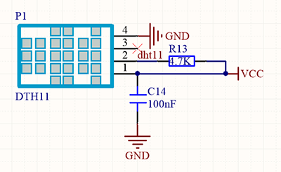
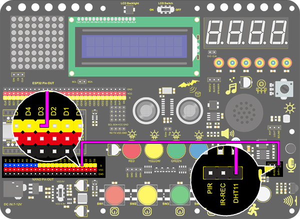
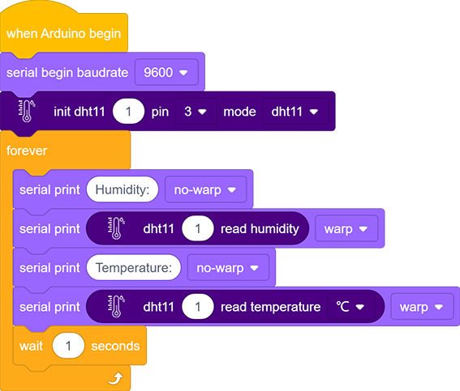
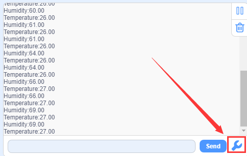
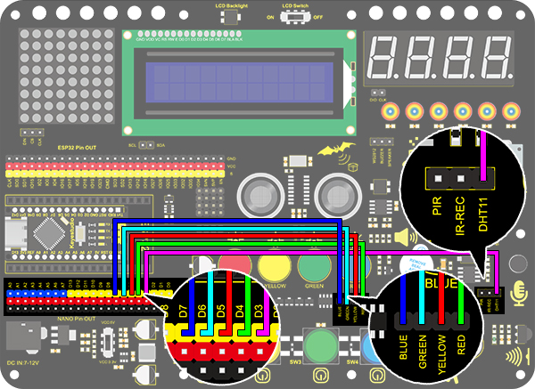
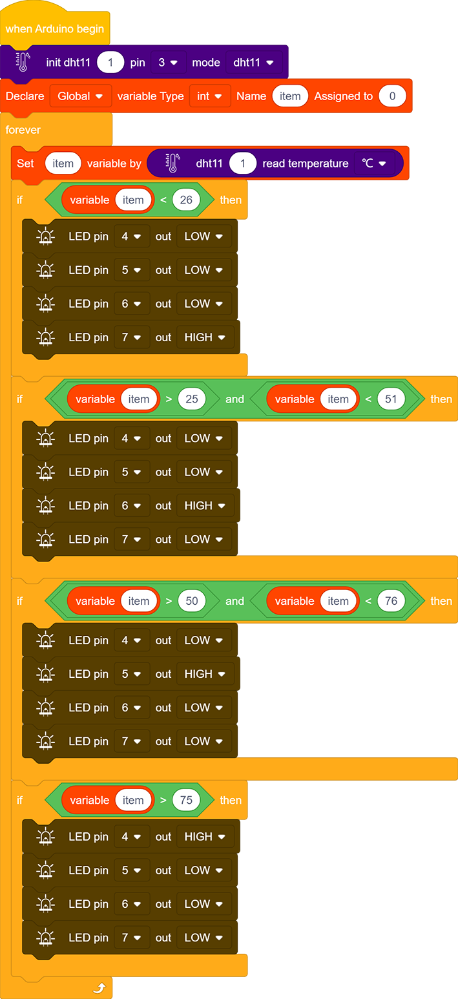

# **Project 23：Smart Cup**

### **1. Description**
In this project, we mainly adopt the Arduino development board to create a programmable smart cup, which reveals the temperature of inner liquid through a RGB indicator. 

By setting threshold values, the indicator will light up in different brightness levels. When the thresholdlevel is exceeded, it will get brighter. Or else, it gets darker. In this way, you will have a better control of drinking water, preventing from being overheated or overcooled.

### **2. Working Diagram**

**Working Diagram:**

Related settings in DHT11 is provided by manufacturers, so you only need to orderly read and process data according to its sequence chart. 

Besides, the relevant codes are packaged in our libraries, which is convenient for you to only set pins and read values. 

### **3. Wiring Diagram**

### **4. Test Code**

### **5. Test Result**

After wiring up and uploading code, click  to open serial monitor to set baud rate to 9600, and the temperature and humidity value will be displayed.

### **6. Expansion Code**

In this expansion experiment, we will make a smart cup which can show liquid temperature. 

We divide 100 into four parts with an LED representing for each: 
Red LED: 75~100°C
Yellow LED: 50~75°C
Green LED: 25~50°C
Blue LED: 0~25°C

**Flow Diagram:**

**Wiring Diagram:**

**Code:**

### **7. Code Block Explanation**

1.In this code block, the marked number can be filled in the blank so that multiple temperature and humidity sensors can be connected. After setting the pin and mode, the value can be read. In this project, we set the mode to DHT11.

2.Read the humidity value directly. 

3.Read the temperature value directly in an optional unit of °C or °F.

