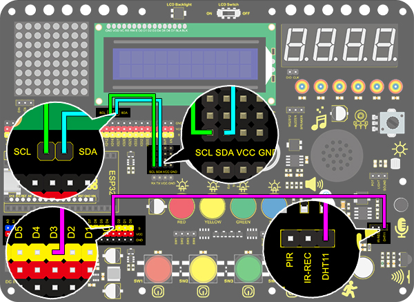
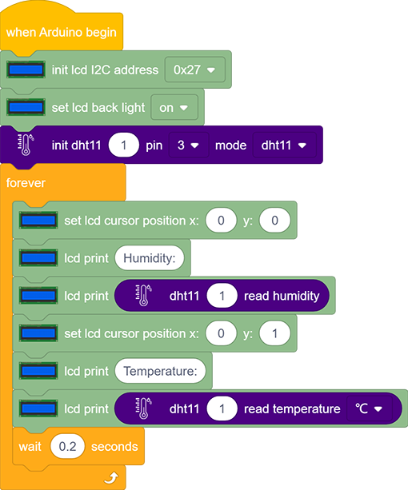
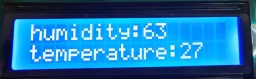

# **Project 24：Meteorological Station**

### **1. Description**

This mini meteorological station records ambient temperature and humidity value via Arduino board and related sensors. 
Beyond that, for a more comfortable surrounding, it also automatically adjust these two values according to environmental parameters.

### **2. Wiring Diagram**

### **3. Test Code**

### **4. Test Result**

After wiring up and uploading code, LCD display will directly discover the ambient humidity and temperature value.

