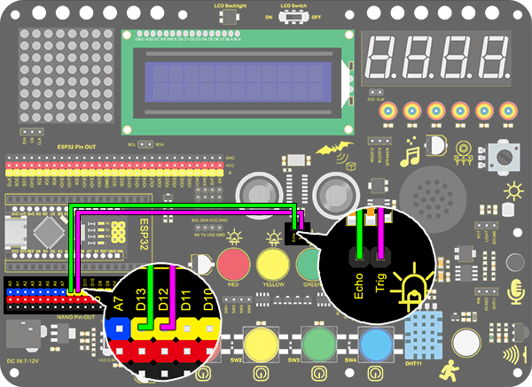

# **Project 25：Ultrasonic Diastimeter**

### **1. Description**
This ultrasonic diastimeter measures distance of obstacles by emitting sound waves and then receiving the echo. That is to say, the distance is not an immediate value, but an observed one by a theoretical calculation of time difference between emitter and receiver. 

Except distance measurement, ultrasonic is able to detect objects' form and existence, set up automatic doors and estimate flow velocity and pressure. 

What's more, this module supports cooperative works with computers. As a result, the measured value can be transmitted to computers via Arduino board. 

In daily life, it is widely used for numerous equipment (such as motors, servo and LED) as well as systems (like automatic navigation, controlling and security monitoring systems).

### **2. Working Principle**

**Working principle:** 

As we all know, ultrasonic is a kind of inaudible sound wave signal with high frequency. Similar to a bat, this module measures distance of obstacles by calculating the time difference between wave-emitting and echo-receiving.

**Maximum distance:** 3M

**Minimum distance:** 5cm

**Detection angle:** ≤15°

### **3. Wiring Diagram**

### **4. Test Code**

In "forever" block, construct two "serial print" blocks and drag a "read distance" block from “Ultrasonic”. Set trig pin to 12 and echo pin to 13 both in cm. Do not forget a delay of 0.5s. The complete code is shown below.

### **5. Test Result**

After wiring up and uploading code, open serial monitor to set baud rate to 9600, and the serial port starts to print the distance value. 

### **6. Expansion Code**

In this expansion project, let's make a diastimeter. 

We display characters on LCD 1602. Program to show "Keyestudio" at (3,0) and “distance:” at (0,1) followed by the distance value at (9,1). 

When the value is smaller than 100(or 10), a residue of the third(or the second) bit still exists. Therefore, an "if" judgment is necessary to determine a certain condition.

**Wiring Diagram:**

**Code:**

1.Drag the two basic blocks.

2.In "LCD", initialize the LCD. Drag an “LCD print” block and add character string “Keyestudio” (It also can be put out of "forever" block as this display is fixed). Add a "variable" block and set type to int and name to "distance" with an initial assignment of 0.

3.Assign the read distance value to the variable "distance". Set the LCD to print “Distance：” and followed by the distance value (and we need calculate the front displayed characters in advance to set a cursor followed them).

4.Build a "clear display residue" block when the number of displayed bits decrease. We firstly adopts a condition to judge whether the distance is smaller than 100(or 10). If it is, a space will be printed at the residue of the third (or the second) bit to clear previous display. 

5.Lastly, don't forget to add a delay of 0.5s. 

**Complete Code:**

### **7. Code Block Explanation**

Read the distance after setting the trig pin and echo pin. The unit of displayed value is optional (cm or inch).

