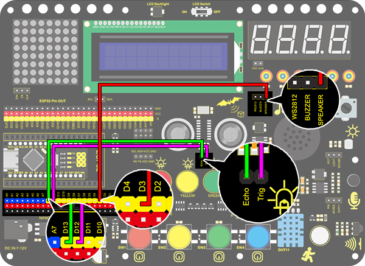

# **Project 26：Human Body Piano**

### **1. Description**
The analog piano includes a development board and an ultrasonic sensor. It plays different tones by detecting the position of your fingers. Thus, this module is able to stimulate a piano to perform music and songs. 

### **2. Flow Diagram**

### **3. Wiring Diagram**

### **4. Test Code**

Assign the distance value to item, and the played tones vary from distance. Seven tones are included: Do，Re，Mi，Fa，So，La，Si.

### **5. Test Result**

Wire up and upload code. 
Play Do when the distance is smaller than 10. 
Play Re when the distance is within 10~20. 
Play Mi when the distance is within 20~30. 
Play Fa when the distance is within 30~40. 
Play So when the distance is within 40~50. 
Play La when the distance is within 50~60. 
Play Si when the distance is within 60~70. 

