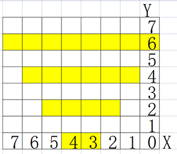
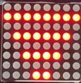
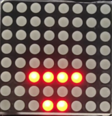

# **Project 27：Intelligent Parking**

### **1. Description**
This intelligent parking system detects and optimizes parking position via ultrasonic sensor. With this system, wrong parking is avoided to a large extent. 

Firstly, you need to install the sensor around the car-park. And then it will detect the distance between the car and its edges and send the information to the development board. After integration, the distance value will be revealed by the lines on the dot matrix display.

### **2. Flow Diagram**

### **3. Wiring Diagram**

### **4. Test Code**

Assign the detected distance value to a variable, and judge whether it is greater than the set threshold value. If it is, corresponding lines on the dot matrix light up. In this way, a distance can be revealed by lighting lines. 

**Reference Coordinates:**

**Complete Code:**

### **5. Test Result**

After wiring up and uploading code, lines displays on the dot matrix. When the detected distance is shorter than 50cm, there are fewer lines.

