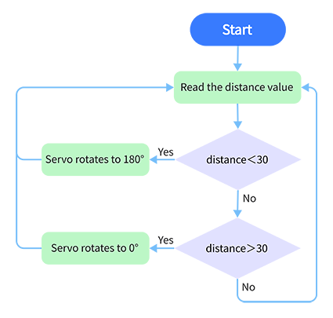
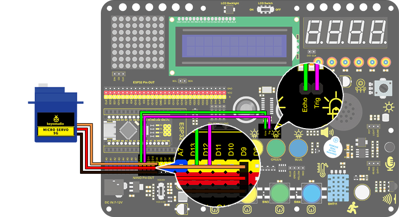
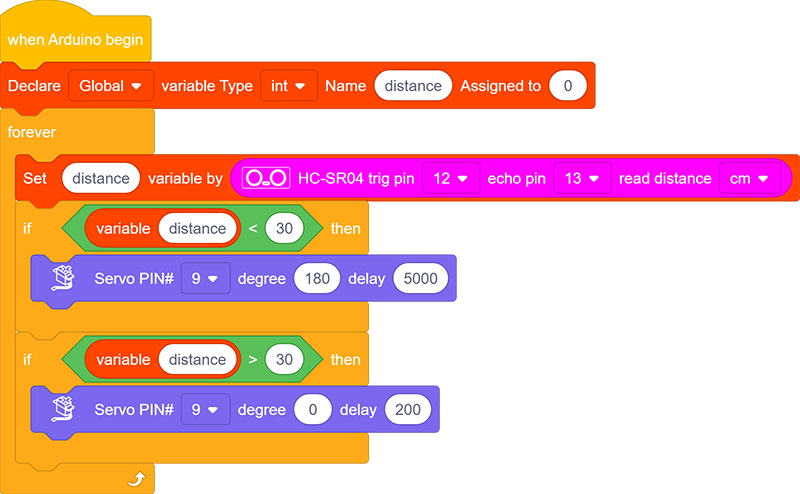

# **Project 28：Intelligent Gate**

### **1. Description**
The intelligent gate integrates MCU and ultrasonic sensor. It measures the distance of car to open or close gate handler. 

When a certain distance is reached, MCU receives the signal from the sensor and estimates the distance via the signal intensity. If the car is approaching or leaving, MCU will open or close the gate via a servo.

### **2. Flow Diagram**

### **3. Wiring Diagram**

### **4. Test Code**

Define a variable "distance" with the assignment of detected distance value by the ultrasonic module. 

Next, Compare the distance value with 30cm. If it is smaller than 30cm, the servo will rotate to 180° and stands for 5s. Otherwise, the servo returns to 0°.

### **5. Test Result**

After wiring up and uploading code, the servo will turn to 180° and stay for 5s if the detected distance is shorter than 30cm. On the contrary, the servo will return to 0°.
