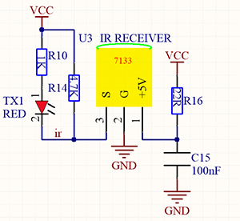
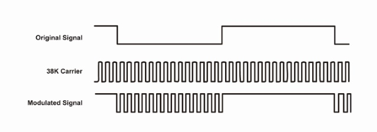
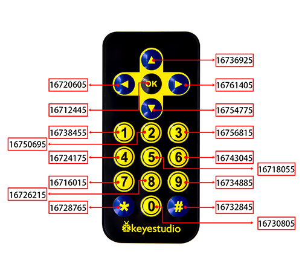
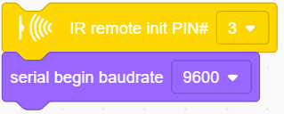
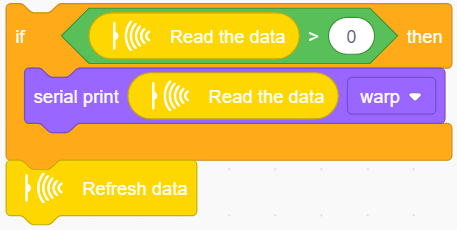
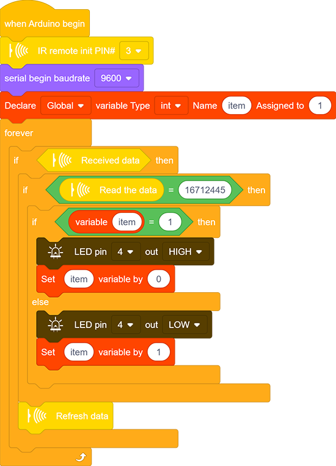

# **Project 29：IR Remote Control**
### **1. Description**
This module uses IR to remotely control LED, which greatly simplifies the ON and OFF of LED. Now that the control is realized by IR signals, there is no need to worry about considerable circuits. 

### **2. Working Principle**

**Working principle:** 

In actual communication, signals usually carries a wide spectrum, and a lot of energy is distributed at a low frequency band. We called it baseband signal, which is not suitable for direct transmission in channels. 

For a convenient transmission, a high anti-disturbance capability and an effective utilization of Broadband, and signals, before transmitting, always need to be modulated to a frequency which is suitable for channels and noise characteristics. This is what we called signal modulation. 

At the receiver of the communication system, signals are usually demodulated to regain the initial baseband ones. In this project, we often use a carrier of about 38K in modulation. 

An IR remote control system is mainly split into modulation, emitting and receiving. It sends data through modulating, i.e., an "**and**" operation between data and carriers with a certain frequency. In this way, the emitting efficiency is enhanced while power dissipation is lowered. 

Generally, the frequency of carrier modulation is within 30khz~60khz, with 38kHz more often. The duty cycle of the square wave is 1/3, as shown below, which is decided by the 455kHz crystal oscillator on the emitting end. 

An Integer frequency division is essential for crystal oscillator at this end, and the frequency coefficient usually evaluates 12. Therefore, 455kHz÷12≈37.9kHz≈38kHz. 

**38KH carrier (complete) emitting diagram:**

**Carrier frequency:** 38KHz

**Wave length:**  940nm

**Receiving angle:** 90°

**Control distance:** 6M

**Schematic diagram of remote control buttons:**

### **3. Wiring Diagram**

### **4. Test Code**

1.Drag the two basic blocks.

2.Find and drag the "IR remote init" block from “IR Remote” and set its pin to 3. Add a "baud rate" block from "serial" and set to 9600.

3.Drag an "if" block and fill its condition with "Received data". Only when the IR module receives data, code blocks in "if" execute.

4.Drag another "if" block and set its condition to "Read the data ＞ 0". Only when this condition is satisfied, serial port starts to print data. 

This sensor works so fast that the code may run twice or more when you are pressing control buttons. However, the second time of a same command will send out a value of 0, so a greater-than block is necessary for the avoidance of duplication. 

5.Add a "serial print" block after "then". Set to print the read data from "IR remote" module in the mode of "warp".

6.In the end, do not forget to refresh data after a full execution. Otherwise, next receiving will be invalid.

**Complete Code:**

### **5. Test Result**

After wiring up and uploading code, open the serial monitor and set the baud rate to 9600. Press the button on the remote control unit, and you will see the value in hexadecimal.

### **6. Expansion Code**

In this expansion code, we will make a light controlled by an IR remote switch. Press OK to light up the LED and press it again to turn it off. 

To realize this repeatable operation, the variable "item" is essential in the whole code. For the first time, item = 0 so codes in "else" run to assign 1 as its new value. For the second time when item = 1, however, "if" block executes to reassign to 0, alternatively.

**Wiring Diagram:**

**Code:**

### **7. Code Block Explanation**

1.Initialize the IR remote module after setting its receiving pin.

2.Judge whether the sensor has received data. If it is, related code blocks will run.

3.Read the received data from IR remote control.

4.Refresh the received data after each complete receiving execution. Or else, the next receiving will is invalid.

