# **Project 30：Smart Home**

### **1. Description**
In this technology era, we are all familiar with smart home. It is a system that can control electric appliance via simple buttons. 

In this project, we stimulate a smart home remotely controlled by infrared sensor. With Arduino MCU as its core, it realizes intelligent control of light, air conditioner, TV and security monitors. 

All in all, this smart home system is convenient and easy to use.

### **2. Flow Diagram**

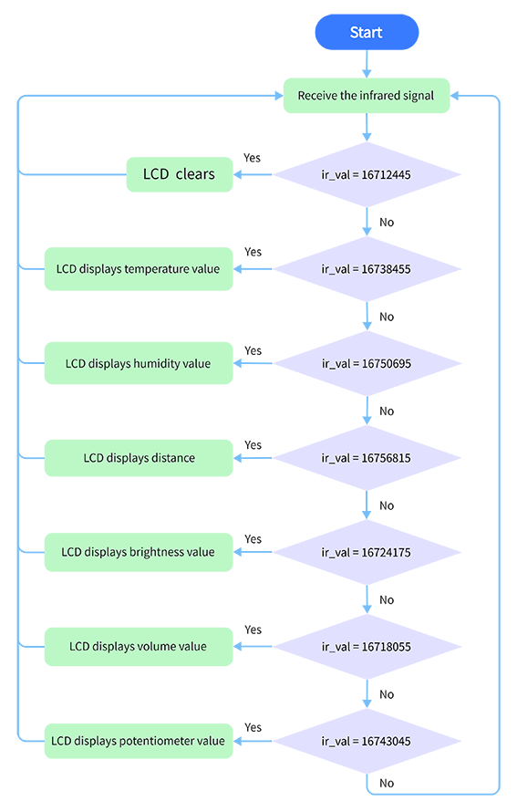

### **3. Wiring Diagram**

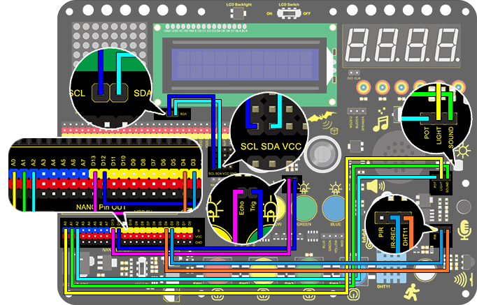

### **4. Test Code**

With the IR remote control, this smart home reveals various sensor values on LCD,including the value of temperature and humidity sensor, sound sensor, photoresistor, potentiometer and ultrasonic sensor. 

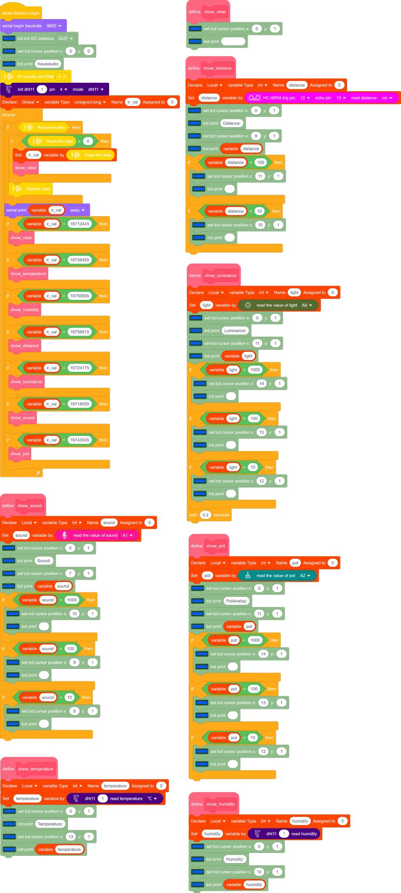

### **5. Test Result**

After wiring up and uploading code, press buttons and observe the displayed contents on LCD.

Press button 1 to display temperature value.

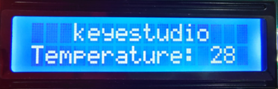

Press button 2 to display humidity value.

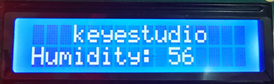

Press button 3 to display distance value.

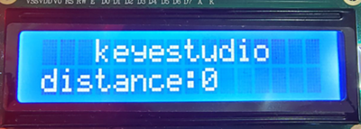

Press button 4 to display luminance value.

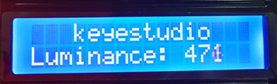

Press button 5 to display the analog sound volume. 

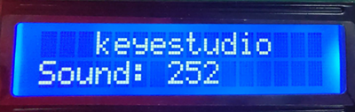

Press button 6 to display the analog potentiometer value. 

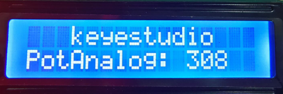

Press button OK to clear the display. 

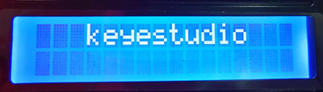

### **6. Code Block Explanation**

The blocks are so many that we adopt "Make a Block" function. By doing this, numerous blocks are packaged and can be directly recalled, which vastly simplifies the whole program. 

Click “My Block” to make a self-defined block, and you may build your own code blocks. 

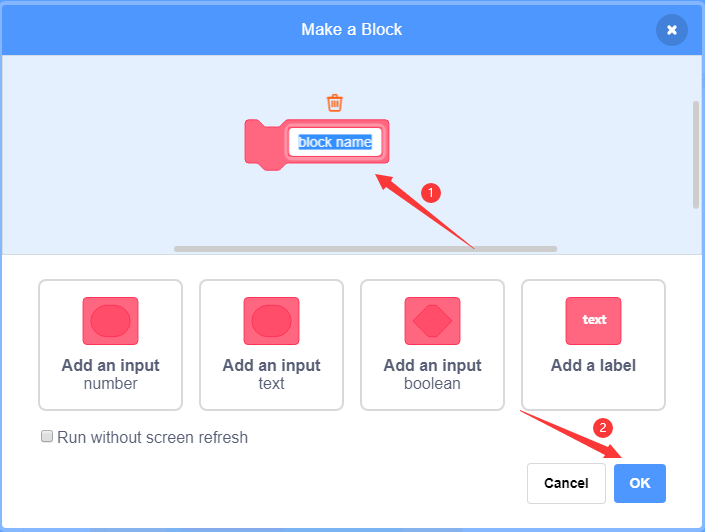

